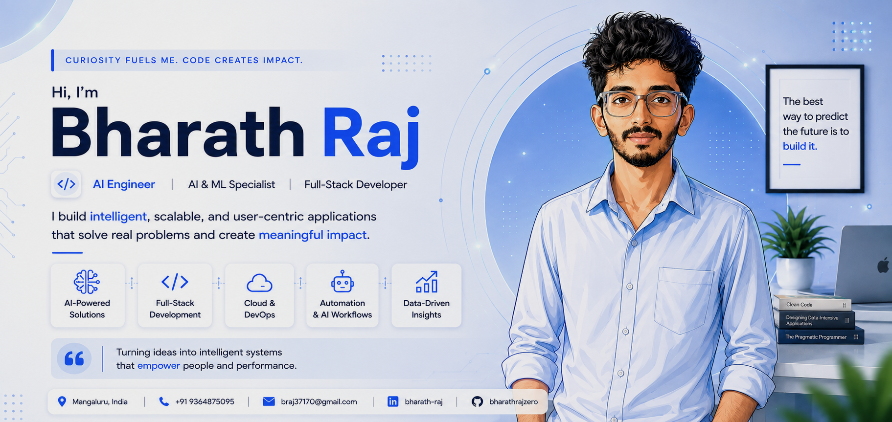

<div align="center">
<!-- Add ?v=1 or ?refresh=true at the end -->




<br/>

<a href="https://bharathrajportfolio.vercel.app"></a>
<a href="https://linkedin.com/in/bharath-raj-aa21a7402"></a>
<a href="mailto:braj37170@gmail.com"></a>


</div>

<br/>

## 📍 About Me

I'm a **B.E. graduate in AI & Machine Learning** based in Mangaluru, India. I build production-ready **Generative AI** applications, ML systems, and full-stack products.

I like taking AI systems past the prototype stage: caching, routing, cost control, and security are as much a part of the work as the model itself.

- 🔭 Currently building AI infrastructure & LLM routing tools
- 🌱 Deepening LangGraph multi-agent orchestration & vector search at scale
- 🤝 Open to AI/ML engineering roles & GenAI product collaborations
- ⚡ Fun fact: I care more about p99 latency than leaderboard accuracy

```yaml
name: Bharath Raj
role: AI & Full Stack Developer
location: Mangaluru, India
focus: [Generative AI & RAG, Agentic Systems, Full-Stack Development]
stack: [Python, FastAPI, React, LangChain]
status: shipping 🚀
```

<br/>

## 🧰 Tech Stack

<div align="center">


<br/>


<br/><br/>


<br/>


</div>

<br/>

## 🚀 Featured Projects

<table width="100%">
<tr>
<td width="50%" valign="top">

### ⚡ [InfraPilot](https://github.com/Bharathrajzero/InfraPilot-AI-Infrastructure-Optimizer)
Full-stack AI infrastructure dashboard modeling LLM workload demand, GPU utilization, API spend, routing, and autoscaling recommendations.

  

</td>
<td width="50%" valign="top">

### 🌱 [GreenRoute-AI](https://github.com/Bharathrajzero/GreenRoute-AI)
Carbon-aware LLM proxy that cuts cloud cost and emissions by routing prompts between edge SLMs, a semantic cache layer, and foundation models.

 

</td>
</tr>
<tr>
<td width="50%" valign="top">

### 🎧 [VibeCheck-AI](https://github.com/Bharathrajzero/VibeCheck-AI)
Semantic audio discovery engine mapping emotions and abstract queries to matching tracks via high-dimensional vector similarity.

 

</td>
<td width="50%" valign="top">

### 🩺 [FUTURE-WELL](https://github.com/Bharathrajzero/FUTURE-WELL-MULTI-DISEASE-RISK-PREDICTION)
Multi-module disease risk prediction system covering several conditions through dedicated ML pipelines.

 

</td>
</tr>
<tr>
<td width="50%" valign="top">

### 🧭 [Career Planner](https://github.com/Bharathrajzero/Career_Planner)
Full-stack career planning app for goal tracking, skill-gap analysis, and personalized learning roadmaps.


</td>
<td width="50%" valign="top">

### 🛡️ GuardSphere
Enterprise AI security gateway that intercepts 16+ adversarial prompt-injection vectors and PII leaks, with sub-50ms synchronous input sanitization backed by a SQLite tracking ledger.

 

</td>
</tr>
</table>

<br/>

## 🎖️ Certifications

| Certification | Issuer |
|:--|:--|
| 🛡️ Endpoint Administrator (MD-102 Pathway) | Microsoft Certified |
| 🧠 Azure Generative AI Application Developer | Microsoft Learn |
| 🤖 Copilot and Autonomous Agent Administrator | Microsoft 365 |
| ✨ Gemini Certified Student | Google for Education |
| 📊 Databricks for Machine Learning | Databricks & Simplilearn |

<br/>

## 📊 GitHub Analytics

<div align="center">

<br/>


<br/>


</div>

<br/>

<!--
  Optional: animated contribution snake.
  1. Add the workflow file provided alongside this README (snake.yml) to .github/workflows/
  2. Push once to main — GitHub Actions will generate the SVG automatically
  3. Uncomment the two lines below once the action has run
-->
<!--
<div align="center">

</div>
-->

<div align="center">

### 💬 Let's Connect

<a href="https://bharathrajportfolio.vercel.app"></a>
<a href="https://linkedin.com/in/bharath-raj-aa21a7402"></a>
<a href="mailto:braj37170@gmail.com"></a>

<br/><br/>

*"The best way to predict the future is to program it — automating the complex, scaling the intelligent."*

<br/>


</div>
